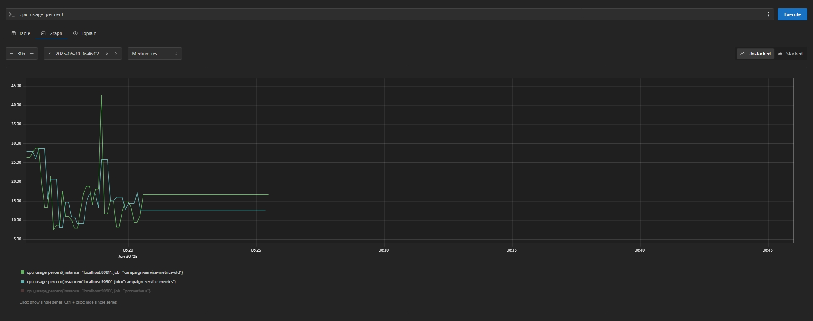
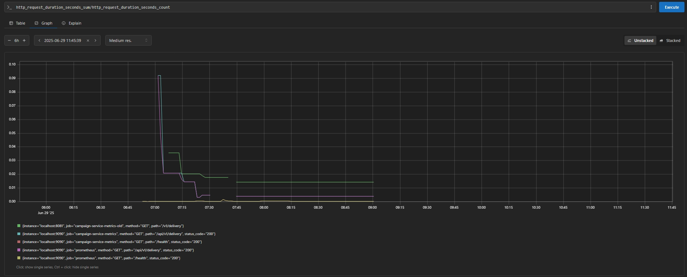

# Campaign Delivery API

A high-performance Go (Gin) API for dynamic campaign delivery with in-memory caching, flexible targeting, and Prometheus metrics.

## Features
- Dynamic extraction of targeting parameters from query string
- Flexible targeting dimensions (app_id, country, os, device_type, language, timezone, age_group, gender)
- Pagination support (page, limit)
- In-memory caching for fast delivery
- Prometheus metrics for monitoring
- Endpoints to fetch available targeting dimensions and values

## Requirements
- Go 1.22+
- PostgreSQL database
- (Optional) Redis for future caching
- Docker (for containerized deployment)

## Environment Variables
The app loads configuration from environment variables or a `.env` file:

| Variable     | Default             | Description                |
|--------------|---------------------|----------------------------|
| DB_HOST      | localhost           | Database host              |
| DB_PORT      | 5432                | Database port              |
| DB_USER      | postgres            | Database user              |
| DB_PASS      | password            | Database password          |
| DB_NAME      | campaign_service    | Database name              |
| APP_PORT     | 8080                | API server port            |
| REDIS_ADDR   | localhost:6379      | Redis address (optional)   |
| REDIS_PASS   | (empty)             | Redis password (optional)  |
| REDIS_DB     | 0                   | Redis DB index (optional)  |
| CACHE_SIZE   | 1000                | In-memory cache size       |
| LOG_LEVEL    | info                | Log level (debug/info/...) |

## Build & Run Locally

```sh
go build -o campaignservice ./cmd/api/main.go
./campaignservice
```

Or run with your own `.env` file:

```sh
APP_PORT=8080 DB_HOST=localhost ... ./campaignservice
```

## Run with Docker

Build the Docker image:
```sh
docker build -t campaignservice .
```

Run the container:
```sh
docker run --env-file .env -p 8080:8080 campaignservice
```

## API Endpoints

- `GET /api/v1/delivery` - Main delivery endpoint (query params: app_id, country, os, etc.)
- `GET /api/v1/dimensions` - List available targeting dimensions
- `GET /api/v1/dimensions/:dimension/values` - List possible values for a dimension
- `GET /health` - Health check
- `GET /metrics` - Prometheus metrics

## Example Request

```

## Screenshots

Below are example Prometheus metrics visualizations from the running service:

### CPU Usage Percentage


### HTTP Request Latency


## Observability Improvements

## DB Schema:


The new codebase introduces several enhancements in monitoring and observability:


- **Custom Metrics:**
  - `cpu_usage_percent` for real-time CPU usage tracking.
  - `delivery_api_latency_seconds` for measuring delivery API latency.
  - `memory_usage_bytes` and `goroutines_total` for resource monitoring.
- **HTTP Request Latency Histogram:**
  - `http_request_duration_seconds` with detailed buckets and labels for method, path, and status code, enabling fine-grained API performance analysis.
- **Database Connection Monitoring:**
  - `db_connections_active` to track active database connections and pool usage.
- **Go Runtime Metrics:**
  - Expanded metrics such as `go_goroutines`, `go_memstats_*`, and `go_threads` for in-depth Go runtime insights.
- **Improved Observability:**
  - These metrics provide comprehensive visibility into CPU, memory, database, and HTTP request performance, supporting better production monitoring and troubleshooting.

### Note:<br>
This repo is tested with Go 1.23.5 and Postgres 15.4. With a 30L+ records.

